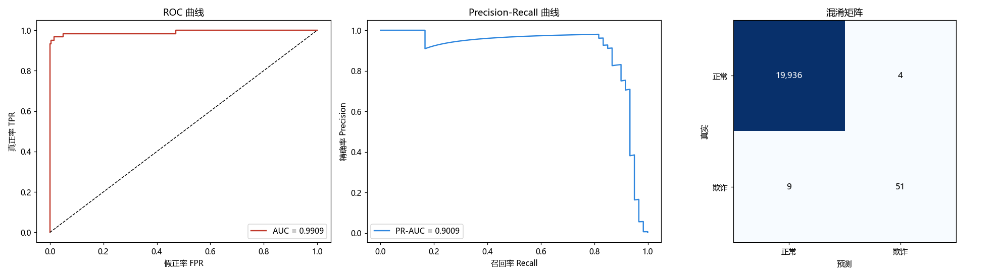

# 信用卡欺诈检测

基于 **XGBoost** 的信用卡欺诈检测(二分类),针对**严重类别不平衡**场景(欺诈样本仅占 0.3%)。

## 效果预览

## 实验结果

| 指标 | 数值 |
| --- | --- |
| 验证集 ROC-AUC | **0.9909** |
| 验证集 PR-AUC | **0.9009** |
| 欺诈类 精确率 / 召回率 / F1 | **0.927 / 0.850 / 0.887** |

## 要点

- 调用 `compute_sample_weight` 计算类平衡样本权重,缓解少数类(欺诈)样本不足;
- 使用 `StratifiedKFold` + `GridSearchCV` 交叉验证与超参搜索,避免过拟合与偏差;
- 评估指标:ROC-AUC、PR-AUC、混淆矩阵、classification_report。

## 技术栈

Python · XGBoost · scikit-learn · Pandas · Matplotlib

## 数据

数据集共 **10 万条样本、30 个特征**(V1–V30 为脱敏特征,另有 ID 与时间),欺诈占比 **0.3%**,类别极不平衡。
因体积较大(约 55 MB),**未纳入仓库**,请自行准备 `data/creditcard.csv`。

## 运行

~~~bash
pip install -r requirements.txt

python train.py      # 训练与评估(样本权重 + 交叉验证)
python evaluate.py   # 输出 ROC / PR / 混淆矩阵图到 assets/
~~~

## 说明

极端不平衡场景下 **准确率没有意义**(全预测为正常也有 99.7%),因此重点看 **PR-AUC 与欺诈类召回率**。
