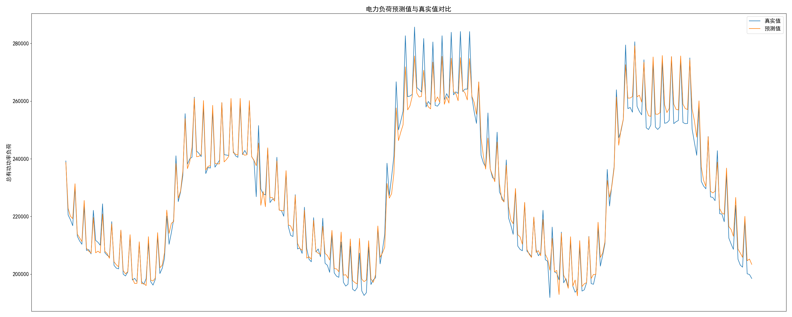
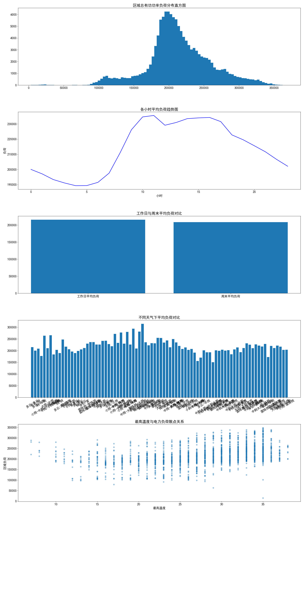

# 电力负荷预测

基于 **XGBoost** 的电力负荷预测应用,融合区域 15 分钟负荷、行业日用电、气象三份数据,提供数据探索、训练、预测与 PyQt5 图形界面。

## 效果预览

### 预测效果

### 数据分析

## 功能

- **数据融合**:基于日期字段融合负荷 / 行业用电 / 气象三份数据(load_power_data)。
- **探索性 EDA**:特征分布与趋势可视化(ana_data)。
- **特征工程**:小时、月、星期、是否工作日,以及周期三角函数与多阶滞后负荷特征(pred_feature_extract)。
- **模型**:XGBoost 回归,按时间有序切分规避时序泄露,输出 RMSE / MAE 评估。
- **三种用法**:训练(src/train.py)、批量预测(src/predict.py)、GUI 加载并预测(src/gui_load_predict.py)。

## 技术栈

Python · XGBoost · scikit-learn · Pandas · NumPy · Matplotlib · PyQt5 · joblib

## 数据

| 文件 | 说明 |
| --- | --- |
| `data/附件1-区域15分钟负荷数据.csv` | 区域 15 分钟粒度负荷数据 |
| `data/附件2-行业日负荷数据.csv` | 行业日用电数据 |
| `data/附件3-气象数据.csv` | 气象数据(温度等) |

## 运行

数据集与训练好的模型(`model/xgb_model.pkl`)**已随仓库提供**,clone 后可直接运行:

~~~bash
pip install -r requirements.txt

python src/predict.py           # 用已训练模型直接预测
python src/gui_load_predict.py  # 启动图形界面
python src/train.py             # 需要重新训练时执行
~~~

## 目录结构

~~~
power_load_forecasting/
├── data/                       # 三份原始数据集 + 效果图
│   └── fig/
├── model/                      # 训练好的 XGBoost 模型与特征顺序
│   ├── xgb_model.pkl
│   └── feature_order.json
├── src/
│   ├── train.py                # 训练
│   ├── predict.py              # 批量预测
│   └── gui_load_predict.py     # PyQt5 图形界面
└── utils/                      # 数据加载 / 特征工程 / 日志
~~~
