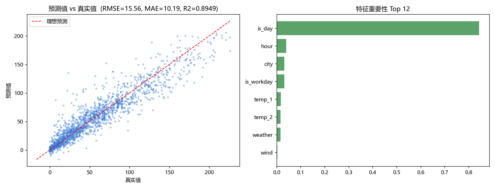

# 表格回归

基于 **XGBRegressor** 的表格回归任务。

## 效果预览

## 实验结果

| 指标 | 数值 |
| --- | --- |
| 验证集 RMSE | **15.56** |
| 验证集 MAE | **10.19** |
| 验证集 R² | **0.8949** |

## 要点

- 特征工程:由 `hour` 派生 `is_day`(7–22 点标记为白天);
- 模型:XGBoost 回归器(400 棵树,max_depth=5,learning_rate=0.05);
- 评估:RMSE、MAE 与 R²,并输出预测值对比与特征重要性图。

## 技术栈

Python · XGBoost · scikit-learn · Pandas · NumPy · Matplotlib

## 数据

| 文件 | 说明 |
| --- | --- |
| `data/train.csv` | 训练集(字段:`id`、`city`、`hour`、`is_workday`、`weather`、`temp_1`、`temp_2`、`wind`、`y`) |
| `data/test.csv` | 测试集 |

两份数据**已随仓库提供**,clone 后可直接运行。

## 运行

~~~bash
pip install -r requirements.txt

python train.py      # 训练并把预测结果写入 data/result.csv
python evaluate.py   # 输出预测对比与特征重要性图到 assets/
~~~
